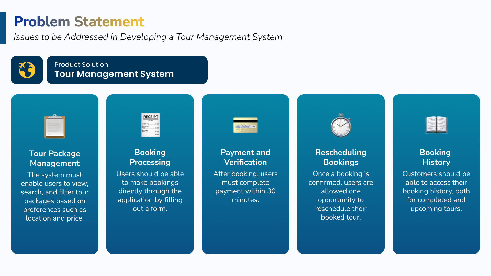
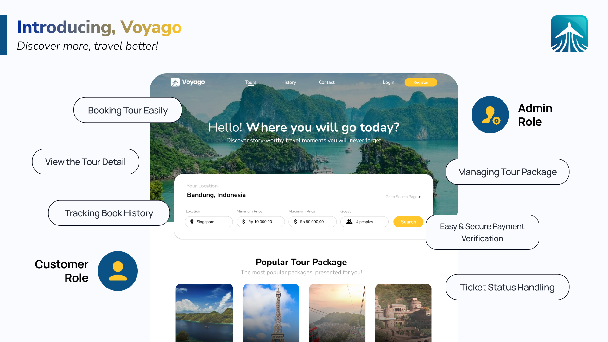
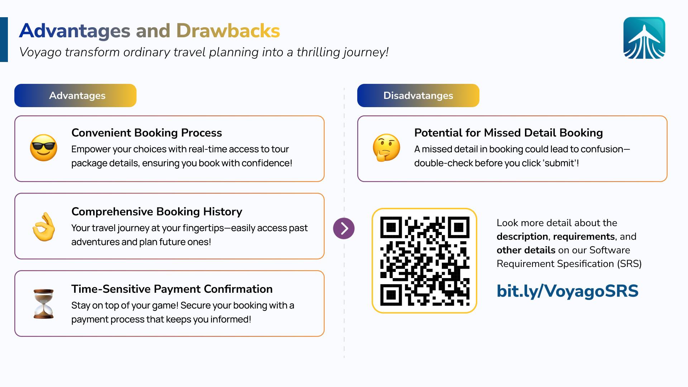
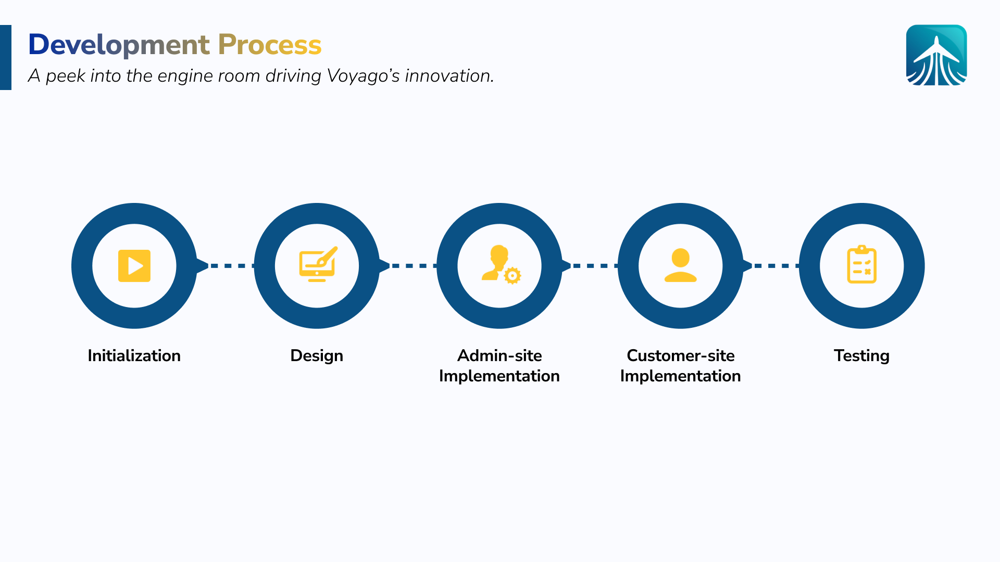
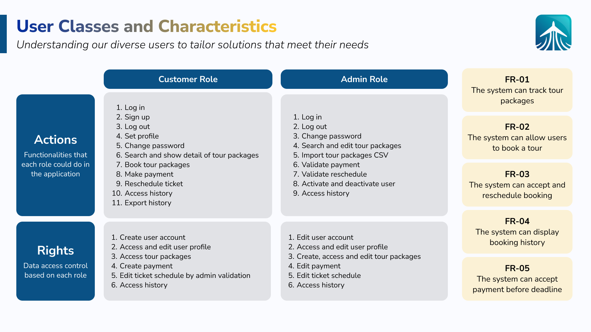
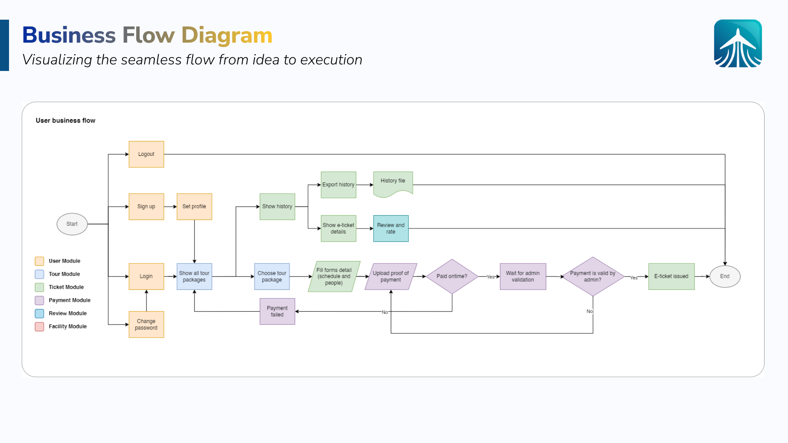
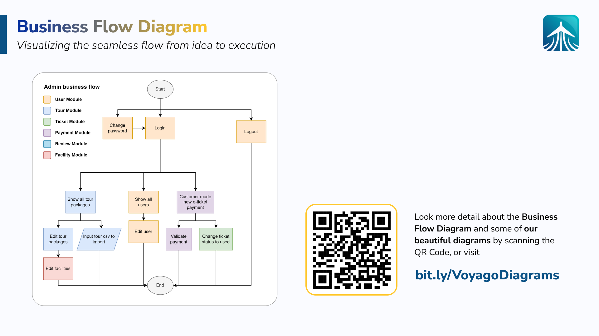
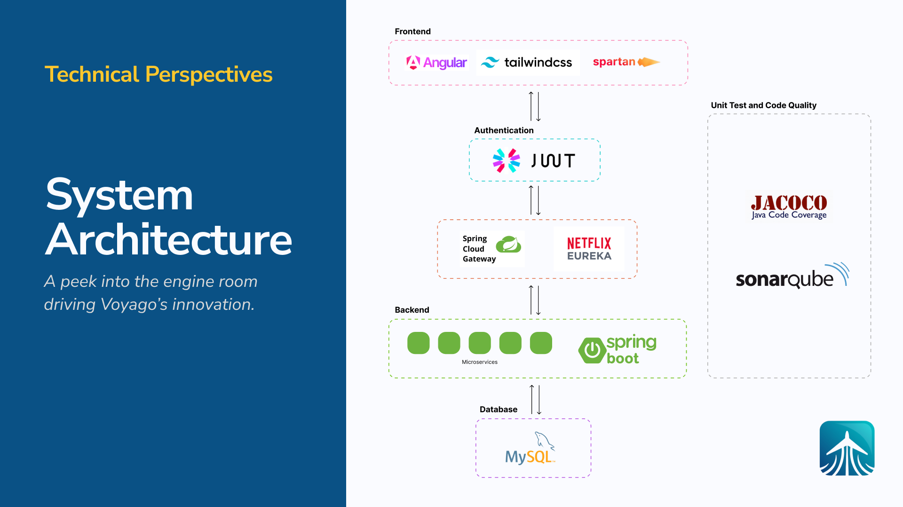

 

    

        
    

    

            <h3><b>Voyago</b></h3>
            
<i>Discover more, travel better!</i>

    
      

 
<h1 align="center">Voyago</h1>

**Voyago: Tour Management System**

Voyago is designed as a comprehensive platform for customers to easily book tour services and vacations, while allowing admins to manage tour packages and user accounts. Customers can browse available tour packages, filter based on preferences, and view detailed information including prices, facilities, and location. Once they choose a package, they can fill out booking forms and proceed with payments, which must be completed within a 30-minute window. Admins oversee tour management, from adding and editing tour packages to verifying user payments and issuing unique e-tickets. Users can also manage their profiles, reschedule tours once, and access their purchase history with options to export the data. The app integrates multiple modules including user authentication, tour and payment management, ticket handling, and history tracking, ensuring a seamless experience for both customers and admins.

## 🤔 Problem Statement

In the tourism industry, particularly in managing tour packages, companies require an efficient system to handle various operational aspects such as booking, customer management, payments, and transaction history tracking. The main challenge in developing such a platform lies in designing a system capable of managing complex business scenarios, including tour bookings and management, payment verification, rescheduling, and processing payments.  

The issues to be addressed in this practical work involve developing a **Tour Management Platform**. Key problems that need to be solved include:  

1. **Tour Package Management**  
    The system must enable users to view, search, and filter tour packages based on preferences such as location and price. Additionally, the system should display detailed information about each tour, including availability.

2. **Booking Processing**
    Users should be able to make bookings directly through the application by filling out a form that includes the date, number of participants, and contact information. The submitted data must be securely stored and managed in the database.  

3. **Payment and Verification**  
    After booking, users are required to complete payment within 30 minutes. The system must ensure that the payment is uploaded by the customer and verified by the admin. If the payment is not completed within the given timeframe, the booking will be canceled.  

4. **Rescheduling Bookings** 
    Once a booking is confirmed, users are allowed one opportunity to reschedule the booked tour.  

5. **Booking History**
    Customers should be able to access their booking history, both for past and upcoming tours.  

## 💡 &nbsp;Solution Key Points

## 👨🏻‍💻 &nbsp;Development Process

### Initialization

The diagram above illustrates the division of two primary user roles within the application: **Customer Role** and **Admin Role**. Each role is equipped with a set of actions and data access rights tailored to the user's specific needs and permissions. 
 
1. **Customer Role** 
    Users with the Customer Role have the ability to perform essential functions such as logging in, registering on the application, and logging out. They can also manage their profiles, search for and book tour packages, make payments, and reschedule tickets if needed. Additionally, customers can access their booking history and even export it to Excel for record-keeping purposes. These features are designed to enhance user experience by giving customers full control over their interactions on the platform.  

2. **Admin Role**
    On the other hand, the Admin Role grants broader privileges than those available to customers. Admins can manage not only their own accounts but also those of registered customers. They can search for, edit, and import tour packages via CSV files, as well as handle critical tasks such as payment validation and rescheduling requests. Furthermore, admins are authorized to activate or deactivate users, ensuring the platform's security and integrity.  

Having defined the access rights for each user role, we proceed to analyze the functional requirements that the software must fulfill. 

After defining all those things, we can define a business flow based on each role.

 

 

> Click each image to enlarge.

This business flow gives an overview of the features of Voyago.

### [Design] System Architecture

For the user interface, **Angular** is used as the primary framework. To ensure a consistent and customizable UI design, a combination of **Tailwind CSS** and **Sparta UI** is utilized for styling.  

On the backend, the system is developed using **Spring Boot**, which is well-suited for building microservices-based applications. **Spring Web** is employed to create REST APIs, while **Spring JPA** is used for database interactions. The database of choice is **MySQL**. In the microservices architecture, an **API Gateway** manages and routes client requests, and **Service Discovery** is implemented to register and locate microservices.  

For authentication, the system uses **JWT (JSON Web Token)**, enabling secure user authentication and restricting access to protected resources based on user roles.  

To ensure software quality, testing is conducted using **JaCoCo** to measure unit test coverage. Additionally, **SonarQube** is integrated into the project to monitor and maintain code quality.  

### [Design] Microservices Architecture

This diagram illustrates a Microservices Architecture Implementation using Spring Cloud Gateway, integrated with microservices, authentication filters, and a discovery service.

1. **Clients**
    At the forefront of this architecture are three types of clients: Browser, Mobile, and Postman. These clients send requests to access various microservices through the Spring Cloud Gateway.

2. **Spring Cloud Gateway**
    The Spring Cloud Gateway, listening on localhost:8080, acts as the entry point for all incoming requests. When a request arrives, the gateway processes it through a series of components:
    - Predicate: Conditions or rules that determine how to route incoming requests.
    - Pre-Filter & Post-Filter: These filters manipulate the request before and after routing it to microservices.
    
    The gateway handles routing by mapping requests to the appropriate services, utilizing Gateway Handler Mapping.

3. **Authentication Service**
    The system also incorporates an Authentication Service, which handles the security aspect by validating credentials through an **Authentication Database**. This service runs on dynamically-allocated ports, ensuring that only **authenticated and authorized** requests pass through the gateway to access other microservices. It sends the results of authentication back to the gateway, either granting or denying access based on user credentials.

4. **Discovery Service**
    To manage service discovery, a Discovery Service is deployed on **localhost:8761**. It registers all the available microservices and stores their IP addresses and ports, enabling the gateway to dynamically route requests to the appropriate service. The discovery service ensures the system remains scalable and flexible by allowing microservices to be registered and discovered in real-time. The gateway retrieves these IPs and ports dynamically from the discovery service, helping to distribute traffic across different instances using load balancing.

5. **Microservices**
    The architecture contains multiple microservices that handle specific functionalities. For instance,
    - The **User Service** manages user-related operations and communicates with the **User Database**.
    - The **Payment Service** processes payments and connects to the **Payment Database**.
    - Similarly, The **Tour Service** handles tour-related operations, interacting with the **Tour Database**.
    - **Ticket Service** is responsible for ticket management and its corresponding **Ticket Database**.

    These services operate independently, maintaining a microservices architecture
    where each service has a distinct responsibility and is connected to its own
    database.

6. **Flow of Requests**
    In this system, client requests, after being authenticated, are routed by the gateway to the correct microservice. For example, if a user requests tour-related information, the gateway routes that request to the Tour Service, which fetches data from the Tour Database and returns a response via the gateway. The use of the Discovery Service allows the gateway to dynamically discover and communicate with these microservices, even as new instances are added or existing ones are updated.

7. **Dynamic Port Assignment**
    A key aspect of this architecture is that the ports used by the microservices (e.g., xxxx, aaaa, bbbb, cccc, dddd) are **dynamically assigned** and **managed by a load balancer**, ensuring that the system can handle multiple requests efficiently and scale as necessary. The architecture's design reflects the principles of microservices, with the Spring Cloud Gateway at its core, providing flexibility, scalability, and dynamic routing capabilities for modern distributed systems.

### [Design] Entity Relationship Diagram (ERD)

This diagram presents a Distributed Database Architecture Design that focuses on implementing seamless data flow between multiple microservices using MySQL databases and Spring Boot as the framework. Each service manages its own database schema while maintaining relationships with other services through foreign key references, promoting both scalability and independence in a distributed system.

The architecture is divided into four main microservices: **User Service**, **Ticket Service**, **Tour Service**, and **Payment Service**, each with its own database schema. For more detail, please read the SRS in [this document](bit.ly/VoyagoSRS)

